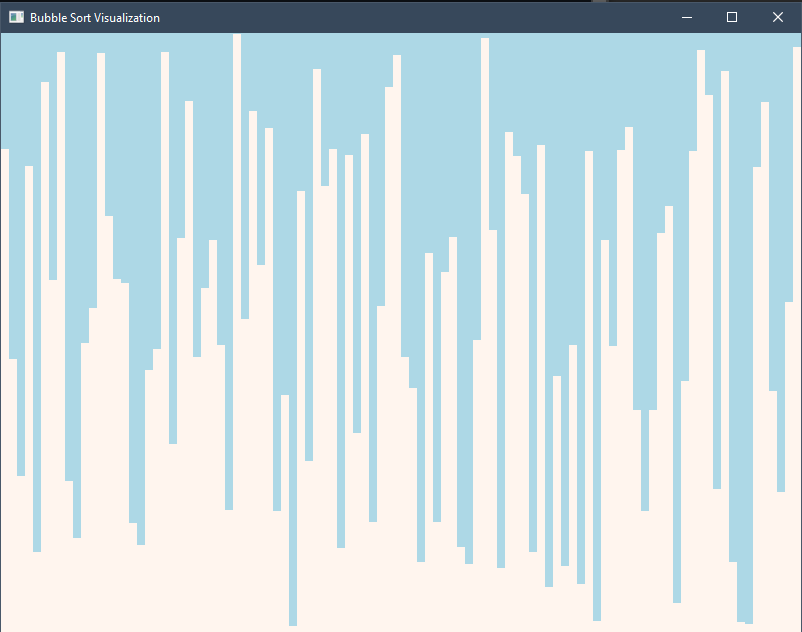
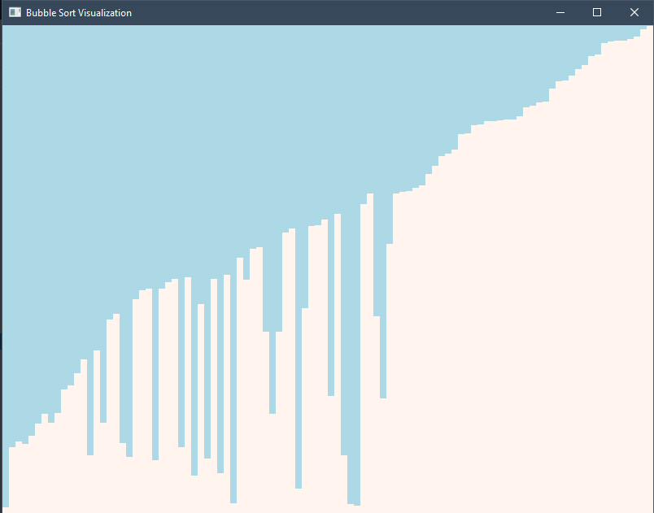
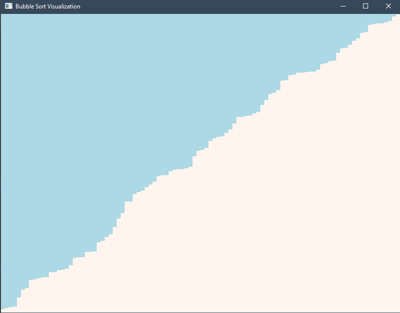

# Sort Visualizer
A SFML based sorting visualizer

* Bubble Sort
* Selection Sort
* Insertion Sort
* Quick Sort
* Shell Sort

## Demo
* Random Data
   
  
* Sorting
   
  
* Done
   
  

## Design
change the repo name:
Can be found in https://github.com/hanbintan2003/Sort/blob/main/design.txt

## Features

- Space Button to play or pause
- r Button to reset
